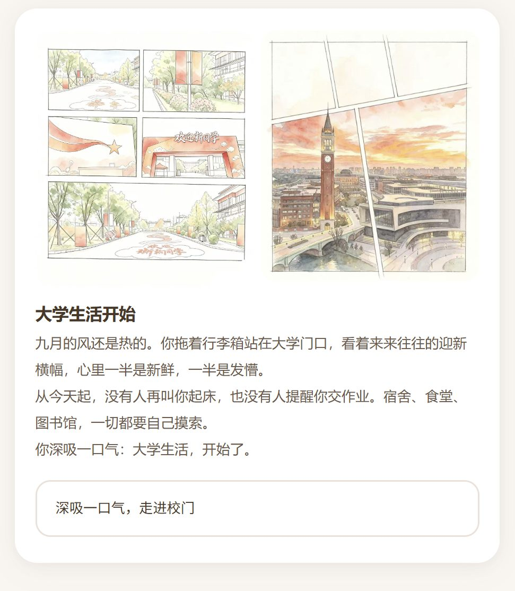

# 🎓 大学生活模拟器

*欢迎新同学。*

一款纯前端的大学生活互动剧情游戏：你作为新生走进大学，在六段真实到牙痒的矛盾里做出选择，最终拿到一份属于自己的生涯报告。


[demo](demo.MOV)
## 在线试玩

**https://match0121.github.io/college-life-simulator/**

点开即玩，无需下载，手机电脑均可。

## 玩法

1. **起步**：选择性别，分配 10 点初始属性（学业 / 实践 / 社交 / 心态 / 自理）
2. **选模式**：理想、困难、随机三选一。
3. **推剧情**：每段矛盾三选一，选择即分岔
4. **收结局**：五维结算段位，称号270 种组合无一重复

## 本地运行

下载项目后直接双击 `index.html`，浏览器即玩。

## 目录结构

```
├── index.html      页面骨架
├── css/style.css   样式
├── js/data.js      剧情文案 / 选项 / 数值
├── js/main.js      游戏引擎
└── images/         剧情配图
```

## 技术说明

纯 HTML / CSS / JavaScript 编写，零依赖，零构建。
